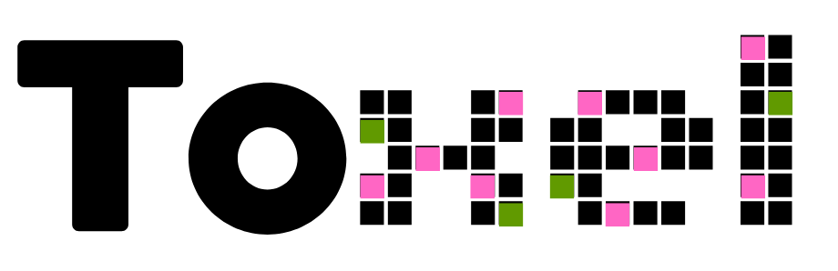

# TOXEL

## Why Toxel?
Toxel is the first Web3 game based on Flow where you can capture the field solo, battling head-to-head against other gamers.
Unleash your creativity — craft stunning art, paint your own NFTs, and earn tokens on this pioneering decentralized playground.

## How to start?
It couldn’t be simpler. All you need is a Metamask wallet that you can connect via WalletConnect and a few of #FLOW tokens to start. Once you’re connected — you’re all set!

## How It works?
Toxel is a blockchain-powered playground that gives you a 10×10 battlefield. You capture territory by purchasing and painting pixels. The initial price of a pixel — when the battlefield is empty — is just 0.001 $FLOW. However, the price of each pixel doubles with every subsequent transaction.

## What to upgrade?
- The ability to add an NFT or a picture on territory you own
- A DAO-basement vote to clear the canvas
- The finalist of the season rewarded with an NFT canvas snapshot at the end of the season or after a DAO vote.
- The ability to teaming up
